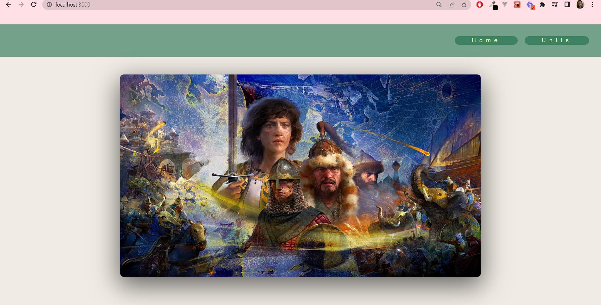
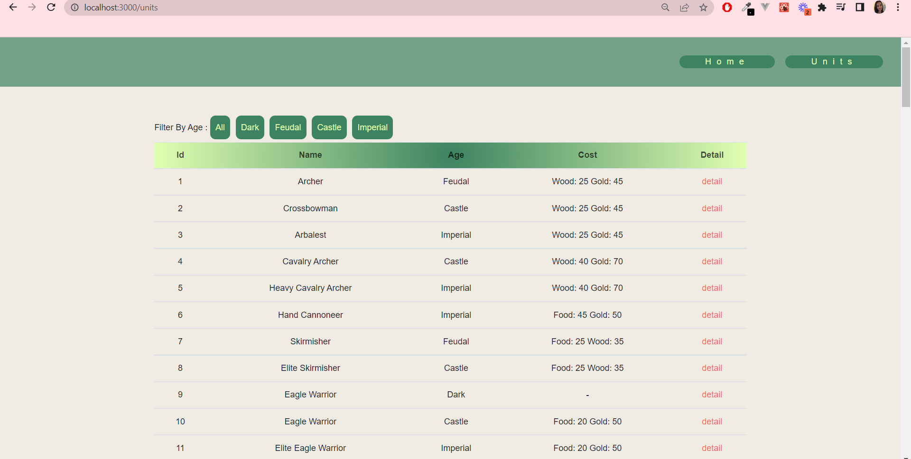
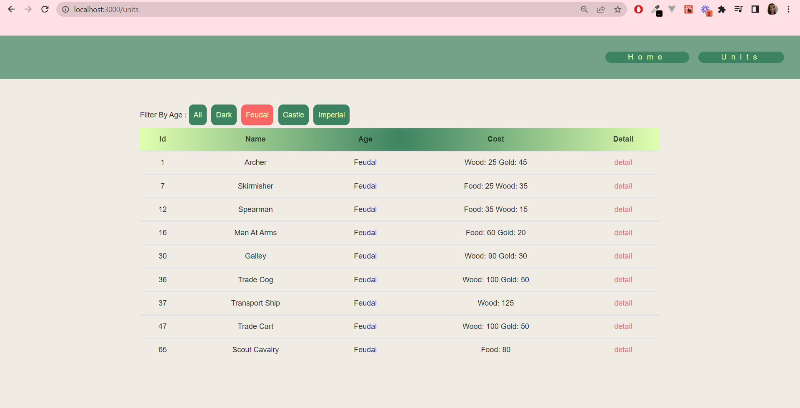
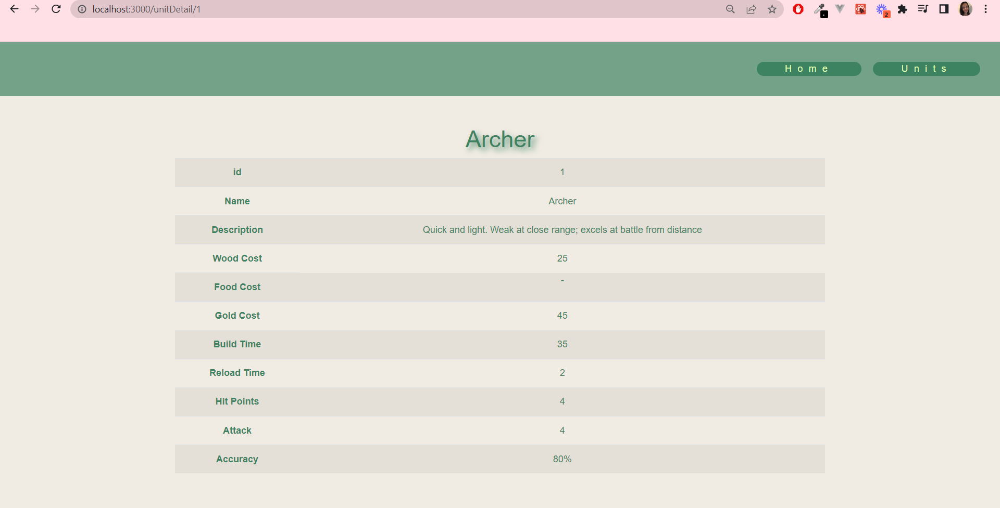

# Age Of Empires

## About Project
- There are 3 pagesin the project. These are Home Page, Units Page and Unit Detail page.
- Users can see listing units in Units Page.
- Users can filter units by age.
- Users can load more starships with a load more button
- Users can click on any item's detail button and go to a detail page that includes details of a specific unit.

## Technologies
- React Js
- React Router
- Redux-Saga
- Axios

## Screenshots
### Home Page

### Units Page
 
### Filter Units By Age
 
### Unit Detail Page
 

### Setup
In the project directory, you can run: 
`npm start` Runs the app in the development mode.\
Open [http://localhost:3000](http://localhost:3000) to view it in the browser.

### Screenshots

